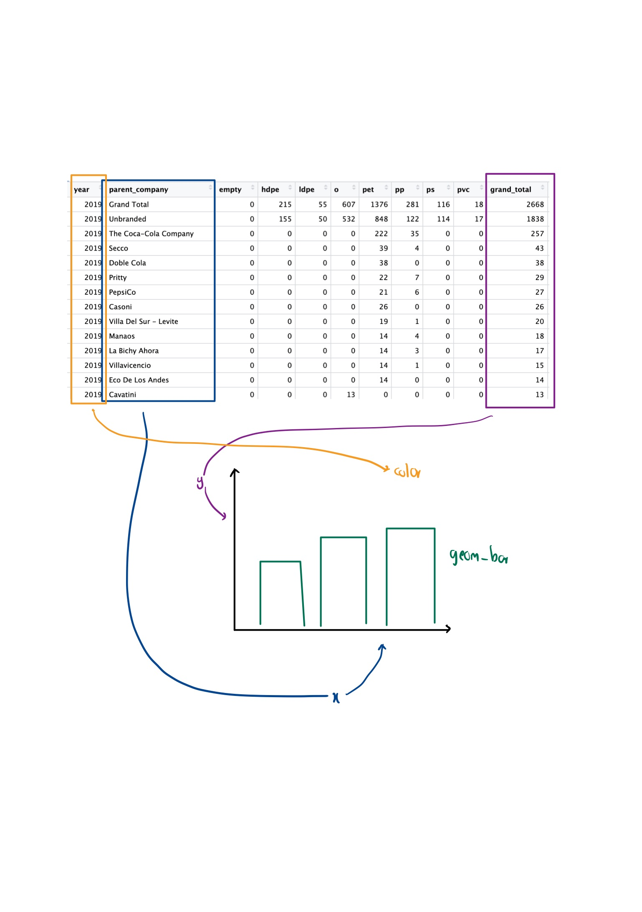
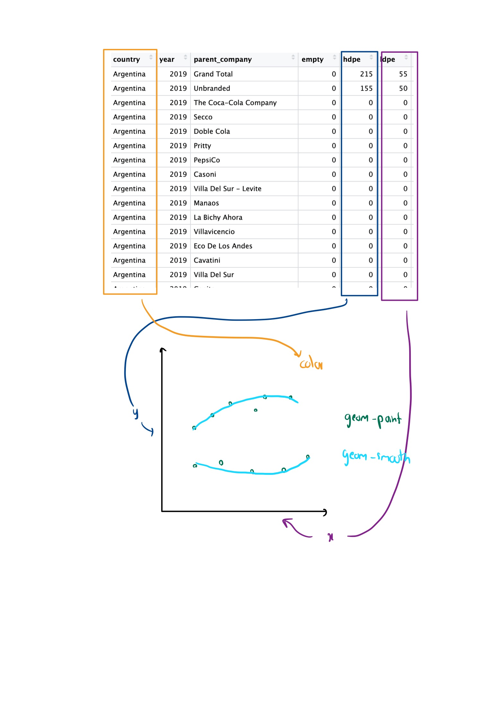

## Project 1 Checkpoint

### Reading Data
```{r}
tuesdata <- tidytuesdayR::tt_load('2021-01-26')
plastics <- tuesdata$plastics
```
### Context of the data
The data comes from Break Free From Plastic's 2019 and 2020 Brand Audits where volunteers collect plastic wastes across multiple countries. The data includes the types of plastic, their respective and total counts, their parent companies, and the number of events and volunteers and the year of the cleanups for the respective countries.

### The Cleaning of the data
The data from 2019 and 2020 files was combined together and a new column 'year' was added for better visibility. Before the combination, the 2019 files were missing the country column so the country name was pulled from the filename itself. And the duplicate columns pp2 and ps2 were merged into the main pp and ps columns by adding them. Some of the columns in 2019 file which had a different name were also renamed before combining both files.

### Research questions that could be addressed with these data
1. Which top companies were responsible for the most plastic pollution in 2019, and how has the trend changed in 2020?

2. Is low density polyethylene plastic more common than high density, and does this vary by country?

### Research questions that could be addressed with supplementary data
1. Does a country's average education level affect its plastic pollution?

2. Are urbanized areas/big cities yielding more plastic waste than tourist attraction spots?

### Visualization




